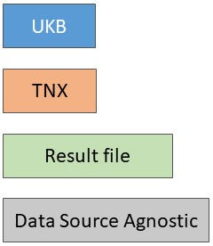
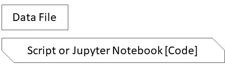
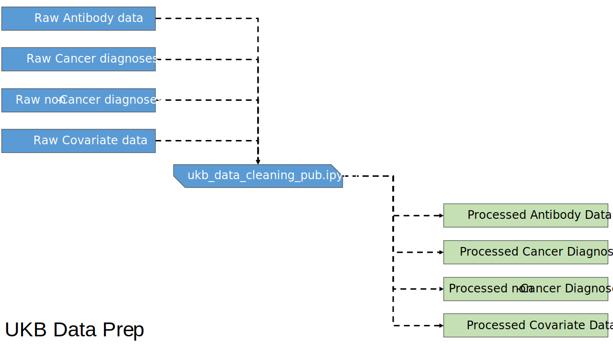
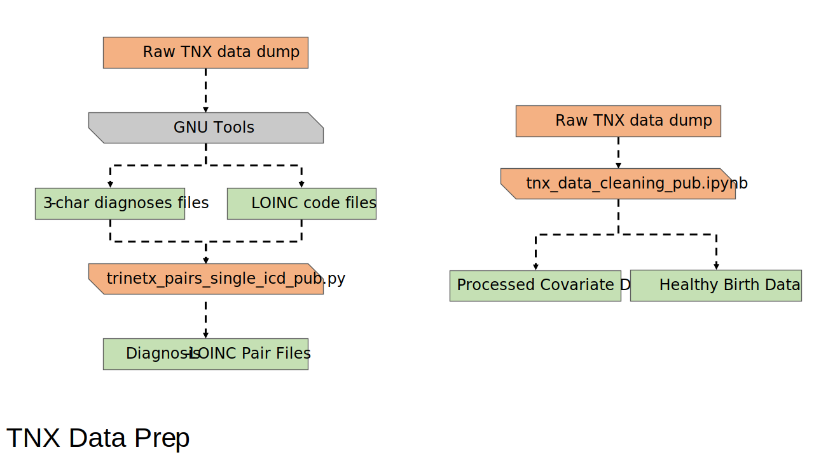
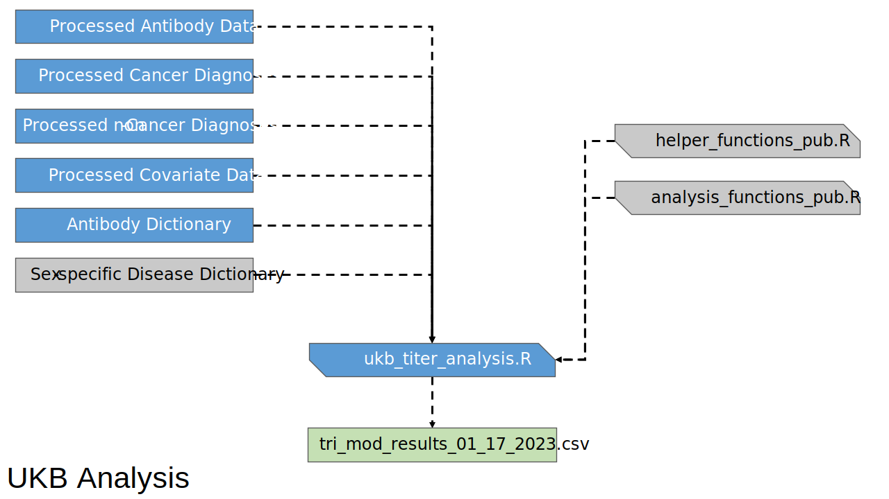
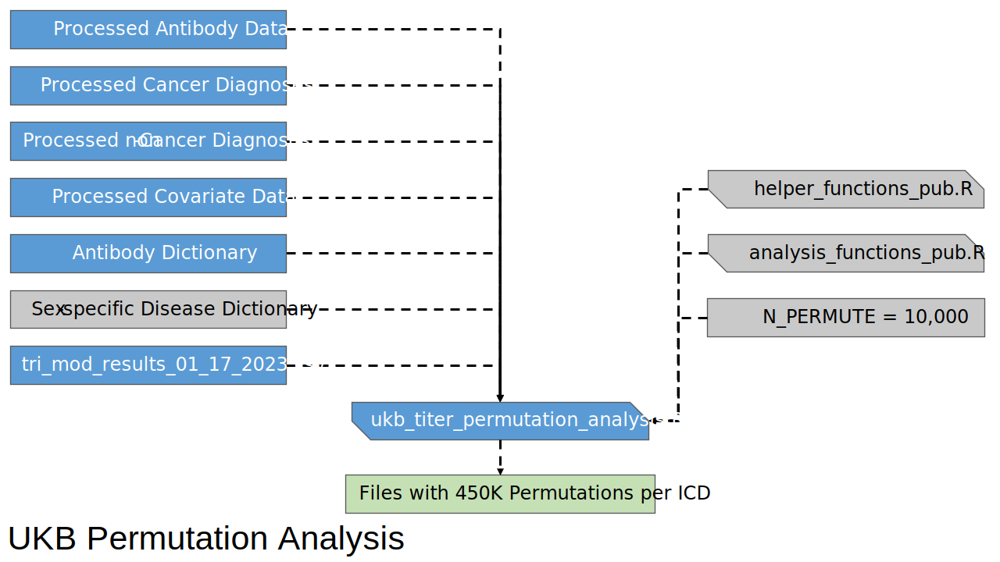
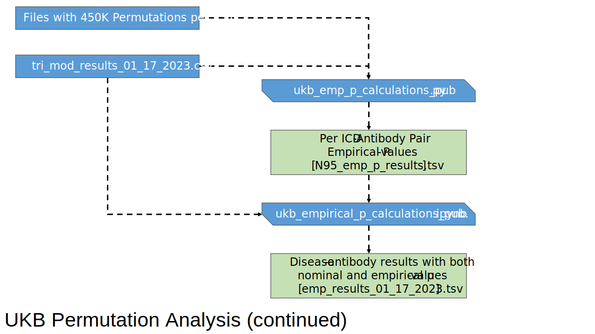
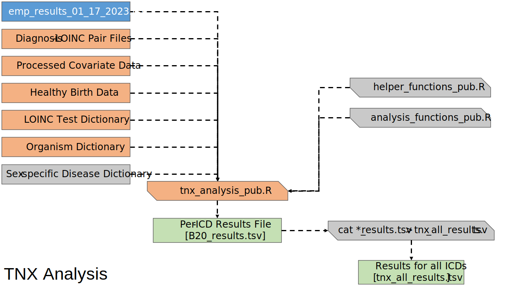

# Overview
The code in this repository is made availabale along with flowcharts for each major piece of code to enable the replication of the results reported in our 2023 paper, given the UK Biobank data and TriNetX data can be obtained from the respective organizations.

## General Notes
All patient identifiers are generic and don't correpsond to actual identifiers from either UK BioBank (UKB) or TriNetX (TNX). They are present just to make it easier to follow what input and output files will look like.

## Software Versions
### Code languages employed
R v4.2.2
Python v3.7.8

### R Libraries
* MASS v7.3-58.1      
* performance v0.10.2
* logistf v1.24.1  
* dplyr v1.1.0
* data.table v1.14.8
* openxlsx v4.2.5.2
* readxl v1.4.2
* stringr v1.5.0
* glue v1.6.2
* DT v0.27

### Python Libraries
* numpy  v1.22.3
* pandas v1.4.2
* scipy  v1.8.0
* sklearn  v1.0.2
* statsmodels v0.13.2
* matplotlib v3.7.1
* seaborn  v0.11.2
* tabulate v0.8.9
* tqdm v4.64.0
* xlrd v2.0.1

### Other 3rd party software
* GNU Parallel v20220122
>        Tange, O. (2022, January 22). GNU Parallel 20220122 ('20 years').  
>        Zenodo. https://doi.org/10.5281/zenodo.5893336

# Flowcharts for main analysis using diagnoses and serology data
## Key for Diagrams
</table>

<table class="tg">
<thead>
  <tr>
    <th>Color</th>
    <th>Shape</th>
  </tr>
</thead>
<tbody>
  <tr>
    <td class="tg-c3ow">
    </td>
    <td class="tg-c3ow"></td>
  </tr>
</tbody>
</table>

## Data Prep

### UK Biobank Data

---

### TriNetX Data

## Analysis

### UK Biobank 

---

#### Permutations and Empirical P-values

   

---

### TriNetX 

## Results Post-processing

## Feedback

Please report any issues with the code in our
[GitHub issue tracker][gi].

With other questions, you may contact [Dr. Matthew Weirauch][matt] via email.

## Contributors

| Name              | Institution                    | Remarks
|-------------------|--------------------------------|--------
| Mike Lape  | University of Cincinnati | _primary author_

## License