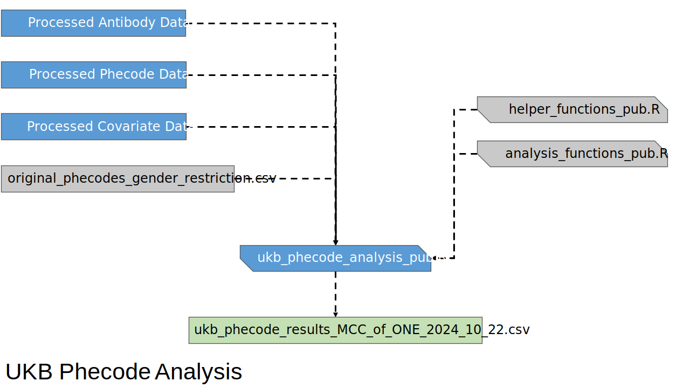

# After the Infection: A Survey of Pathogens and Non-communicable Human Disease

## Study Design

---

## Repository Description

This GitHub repository contains the code used to process raw data to final
results for the study Lape, _et al._ "A survey of pathogenic involvement in
non-communicable human diseases" (2025). See [below](#how-to-cite) for citation
information. It has been updated to include an analysis using Phecodes instead
of ICD10 codes as the outcome variable.

This code is made available along with explanatory flowcharts below to enable
the replication of the results reported in the associated manuscript.
[UK Biobank][ukb] data and [TriNetX][tnx] data must be obtained from the
respective organizations.

## Manuscript Abstract

> <h3>Background</h3>
> Many relationships between pathogens and human disease are
> well-established. However, only a small fraction involve diseases considered
> non-communicable (NCDs). In this study, we sought to leverage the vast amount
> of newly available electronic health record data to identify potentially
> novel pathogen-NCD associations and find additional evidence supporting known
> associations.
>
> <h3>Methods</h3>
> We leverage data from The UK Biobank and TriNetX to perform a systematic
> survey across 20 pathogens and 426 diseases, primarily NCDs. To this end, we
> assess the association between disease status and infection history proxies
> using a logistic regression-based statistical approach.
>
> <h3>Results</h3>
> Our approach identifies 206 pathogen-disease pairs that replicate in both
> cohorts. We replicate many established relationships, including
> <em>Helicobacter pylori</em>, with several gastroenterological diseases and
> connections between Epstein-Barr virus and both multiple sclerosis and lupus.
> Overall, our approach identifies evidence of association for 15 pathogens and
> 96 distinct diseases, including a currently controversial link between human
> cytomegalovirus (CMV) and ulcerative colitis (UC). We validate the CMV-UC
> connection through two orthogonal analyses, revealing increased CMV gene
> expression in UC patients and enrichment for UC genetic risk signal near
> human genes that have altered expression upon CMV infection.
>
> <h3>Conclusions</h3>
> Collectively, these results form a foundation for future investigations
> into mechanistic roles played by pathogens in the processes underlying NCDs.
> All results are easily accessible on our website,
> https://tf.cchmc.org/pathogen-disease.

## General Notes

All patient identifiers are generic and don't correspond to actual identifiers
from either UK BioBank (UKB) or TriNetX (TNX). They are presented to make
it easier to follow the code as well as inputs and outputs.

## Software Versions

### Languages utilized

* R 4.x
* Python 3.x

#### Additional Libraries

| R Libraries      | Python Libraries
|------------------|-----------------
| DT               | numpy
| MASS             | pandas
| argparse         | scipy
| data.table       | sklearn
| dplyr            | statsmodels
| glue             | matplotlib
| logistf          | seaborn
| openxlsx         | tabulate
| performance      | tqdm
| progress         | xlrd
| pryr             |
| readxl           |
| stringr          |
| tidyr            |
| vroom            |
| writexl          |
| PheWAS v0.99.6.1 |

### Other 3rd party software

* [GNU Parallel][parallel] v20220122

    > Tange, O. (2022, January 22). GNU Parallel 20220122 ('20 years').
    > Zenodo. https://doi.org/10.5281/zenodo.5893336

## Flowcharts for primary analysis using diagnoses and serology data

### Key for Diagrams

| Color          | Shape
|:-------------:|:------------------:|
|  |  |

## ICD10 Analysis
### <u>UK Biobank</u>
#### Data Prep

---

#### Analysis

---

#### Permutations and Empirical P-values

 

---

### <u>TriNetX</u>
#### Data Prep

---

#### Analysis

---

### Results Post-processing

## Phecode Analysis
### <u>UK Biobank</u>
#### Data Prep

---

#### Analysis

---

### <u>TriNetX</u>
#### Data Prep

---

#### Analysis

---

### Results Post-processing

## How to Cite

Code from this repository may be cited as:

> Michael Lape, _et al_. (2023). WeirauchLab/pathogen_ncd: Preprint release
> (preprint). Zenodo. https://doi.org/10.5281/zenodo.8423556

The associated manuscript is [Lape, _et al_., _Commmuncations Medicine_
2025][commed]:

> Lape, M., Schnell, D., Parameswaran, S. _et al_.
> A survey of pathogenic involvement in non-communicable human diseases.
> _Commun Med_ 5, 242 (2025). https://doi.org/10.1038/s43856-025-00956-x

## Feedback

Please contact [the co-corresponding authors][corrauth] of the manuscript via
email with any questions or suggestions.

## Contributors

| Name        | Institution                    | Remarks
|-------------|--------------------------------|------------------
| Mike Lape   | University of Cincinnati       | _primary author_
| Kevin Ernst | Cincinnati Children's Hospital | _contributor_

## License

Analysis source code is &copy;2023-2025 Cincinnati Children's Hospital Medical
Center and Mike Lape. Web site source code (the `web` subdirectory) is
&copy;2023-2025 Cincinnati Children's Hospital Medical Center, Mike Lape, and
Kevin Ernst.

Released under the terms of the GNU General Public License, Version 3. See
[`LICENSE.txt`](LICENSE.txt)

[ukb]: https://www.ukbiobank.ac.uk
[tnx]: https://trinetx.com
[parallel]: https://www.gnu.org/software/parallel
[corrauth]: mailto:Matthew.Weirauch@cchmc.org,Leah.Kottyan@cchmc.org&subject=Feedback%20about%20weirauchlab/pathogen_ncd%20project
[commmed]: https://doi.org/10.1038/s43856-025-00956-x
